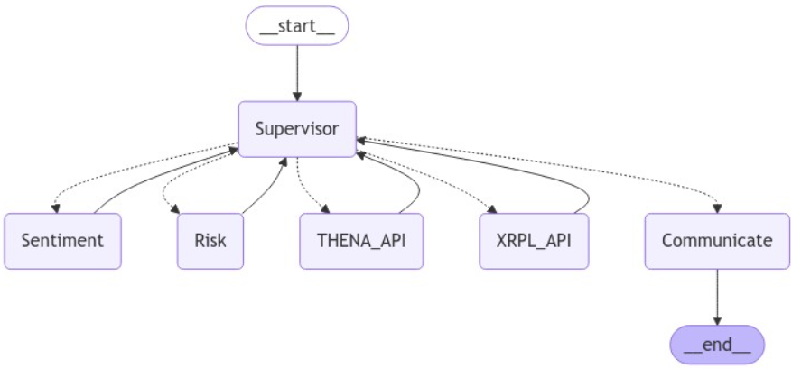

# Setup
Setup your virtual environment and install the requirements:
```
uv venv # Create a virtual environment with https://github.com/astral-sh/uv
source .venv/bin/activate
uv pip install -r requirements.txt
```
More specific setup instructions can be found in the notebook for relevant APIs being used.

# Overview
This document provides an overview of the research conducted on areas of integration between AI Agents and crypto trading protocols such as THENA, HyperLiquid and XRPL.

Our project aims to enhance user experience according to their profile(risk appetite, goals, token type preferences etc), optimize liquidity management and improving decision making across the ecosystem. We are targeting retail users (more specifically people considered to be uninformed traders) by aiding them in research (sentimental analysis on KOLs tweeter, news, governance proposals etc), decision making(suggestions for pricing, market entry and position size for staking, pooling, and  reallocation etc) and automation of on chain trading, LP & staking. 

In a way, this achieves the goals of liquidity optimization, risk management, governance decision support, sentiment & market analysis and user experience enhancement. 

See more here: https://www.youtube.com/watch?v=se49l2aXVGA

## Introduction
Too many options and too much uncertainty can lead to decision paralysis. Especially for uninformed traders, the amount of information available can be overwhelming. Don't you wish there was someone to guide you along?

Specifically, our app wants to address the difficulty that new users to web3 ecosystem face when onboarding to trade cryptocurrencies and tokens. On top of protocols being complex and confusing to navigate, a few examples of such difficulties are not knowing and not knowing how to research things like legitimacy, regulatory requirements and risk management. As such, our project Tragents, a chat interface powered by multiple agents aims to simplify cryptocurrency investments for users by abstracting away the complexity and extensive research that needs to be done. From a single interface, users would be able to get their questions answered and be guided by insights that they would have otherwise neglect. 

Our project also aligns with the goal of global education development and reducing inequality as a result.

## Architecture
A system crew of agents responsible for different tasks, built using LangChain(a composable framework for building LLMs).
There is a supervisor module responsible for managing the agents and their interactions. The agents are responsible for different tasks such as:
- Communication
- Sentiment Analysis
- Risk/Compliance Analysis
- Making API calls



We decided to also go with a RAG architecture because of the benefit as described by the OpenAI cookbook. It says that when you fine-tune a model, it's like studying for an exam one week away.When you insert knowledge into the prompt via retrieval, it's like taking an exam with open notes.

The RAG database is populated with with information scraped from pages providing relevant information on trading platforms. 

Our RAG model is agentic RAG, where agents are able to loop and evaluate themselves if the answers are satisfactory.
Additionally, each agent is able to search the web for information if they don't already have enough information available to them. This is made possible with the Tavily tools binded to the agents.

Why Gemini 1.0 pro? We chose Gemini 1.0 as our LLM model because it is capable of reasoning and has sufficient context window. Just enough such that it is not too expensive to run and not too small to be useful.

Why use LangChain? It is extremely difficult to build systems that reliably execute tasks in practice and more control is often necessary. LangGraph helps to add better precision and control to agent workflows from langChain components.
Graph state (usually inherit typedict -> fields of state can be string or list of messages(eg. AIMessage, HumanMessage, ToolMessage or SystemMessage))
Nodes (functions on state -> often times you choose to return a state. LLM model is treated as a function)
Edges (connecting nodes)
Messages (something for graph / model to invoke)

Why use a multi-agent crew? Same reason as to why we separate software into modules when writing code. Easier to extend each individual module when adding functionality and also separation of concerns allows for more flexible experimentation of components (eg. trying different model providers) while ensuring the entire flow is still coherent as a whole.

We hope that with our app, users will have one click access to all the information they need to make informed decisions. All within the convenience of a chat interface.

## More on XRPL
We use XRPL meta’s endpoints for getting a list of tokens and token specific information.
hit up for a list of tokens: https://s1.xrplmeta.org/tokens to get currency:issuer for subsequent query
hit up specific token https://s1.xrplmeta.org/token/{identifier} . For example:
https://s1.xrplmeta.org/token/USD:rvYAfWj5gh67oV6fW32ZzP3Aw4Eubs59B
https://s1.xrplmeta.org/token/CNY:razqQKzJRdB4UxFPWf5NEpEG3WMkmwgcXA

If you visit the links, for each token, you can see there’s things like trust level (kind of like amount of “KYC” done by the publishers and other authorities, 3 being highest and 1 being lowest if I recall correctly). You also have things like associated weblinks, which our AI agents can be further researched and trained to scrape info from to gain some extra alpha.

We also defined functions to lookup DEXes for offers in our ipynb, and also capability for agents to make offers. As this is just a demo, we omitted functions like cancelling and modifying orders, which are actually crucial in real life.


## Limitations
0. Due to time and credits constraints the code has not been extensively tested. Please make a pull request and I’ll fix. The overall idea should be mostly correct
1. not holding token on mainnet so cannot use faucet...(for Hyperliquid, requires token from Arbitrum Sepolia, and THENA)
2. hence no way to call on chain functions from agent
3. no way to verify if agent is making correct calls
4. no way to verify if agent is making correct decisions

## Roadmap
We have identified areas for further R&D.
The next steps in our roadmap are to:
- Data collection and tuning via LangSmith and human feedback 
- Implementation of long term memory for cross session usage for bookkeeping and user preferences
- Speech recognition for better UX 
- Guardrails to assert function and tool calls by AI agent is correct
- use zkML or trusted execution environments for verifiability and integration with web3 insurance, to cover and protect users in case of disputes
- Explore agent crew with self trained models and adaptations, which are fine tuned for more specialised algorithmic trading functions
- arbitrage -> exploiting sets of 3 or more assets on exchanges where prices are not aligned. On XRPL, there are circular payments for multiple asset trades, but requires pathfinding(specify tokens and issuers) for profitable arbitrages. Requires ability to gauge if there is enough liquidity, tight enough spread, delays, transfer fees and gas fees incurred still result in profit.
- quantitative trading -> predicting and exploiting future price movements based on past price movements. need to be able to calculate potential returns based on current ledger state & past trades + log possible bot actions when tested against historical data. since errors are multiplied in large numbers of trades, need to note:
- rounding errors with formats and tick sizes
- adjustments to account for slippage
- transaction flags for ripple
- explore viable tokenomics and revenue models


